# AWS Application Migration Service (MGN) — Production Implementation 
## Continuation from (Agent Installed) → Full Cutover & Cleanup


**Assumed starting state:**
- MGN is initialized in the target region (`mgn-region-init` already done, IAM role `AWSApplicationMigrationServiceRolePolicy` / `AWSApplicationMigrationAgentPolicy` in place)
- Replication Settings Template configured (staging subnet, staging security group, EBS type, encryption)
- Agent (`aws-replication-installer-init`) executed on the source server(s)
- Source server has just registered and appears in the MGN console under **Source servers**

---

## 0. High-Level End-to-End Architecture

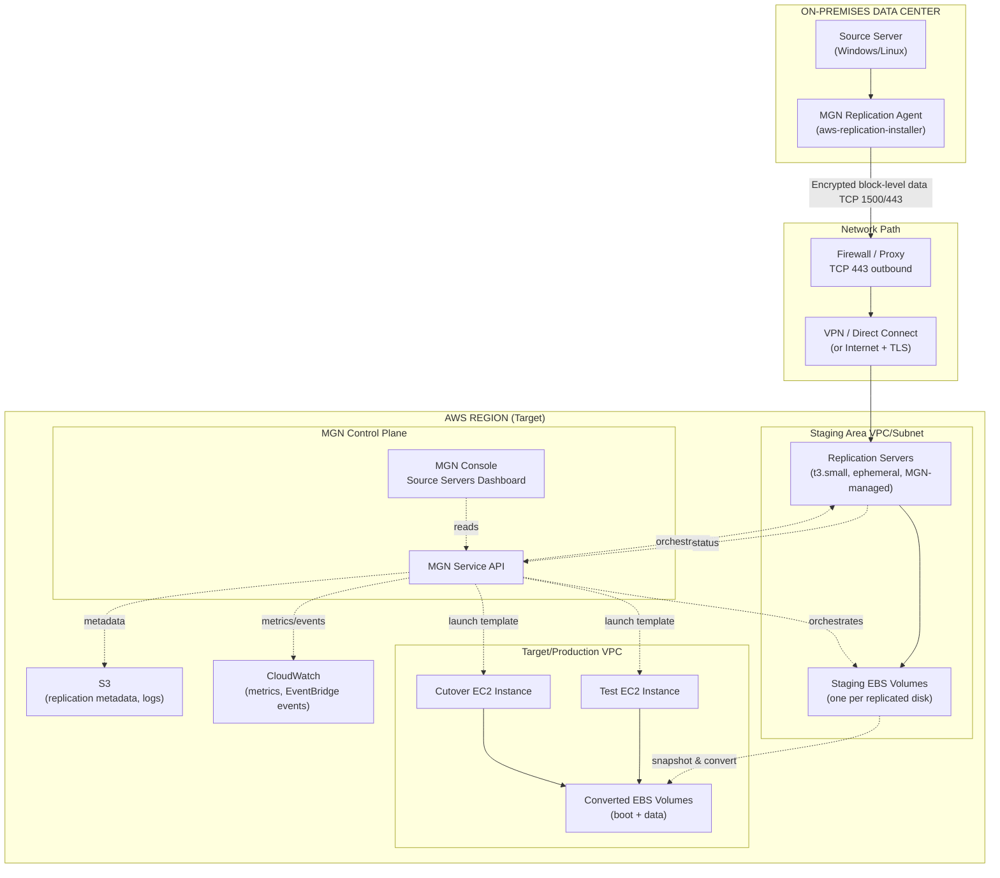

**Key architectural fact you must internalize:** MGN never touches your target/production instance during replication. All continuous replication writes land on **staging-area EBS volumes** attached to **temporary, MGN-owned replication server EC2 instances** that live only in the staging subnet. Your real EC2 instance (test or cutover) is only created at **launch time**, by taking a point-in-time snapshot of the staging volumes and converting it into a boot-capable EBS volume attached to a freshly launched instance built from your **Launch Settings** (or Launch Template).

This separation is why:
- Replication can run for days/weeks with zero impact on production launch configuration
- You can test-launch repeatedly without affecting ongoing replication
- Cutover is fast (it's a launch + final delta sync, not a full data copy)

---

## 1. Source Server Registration & First Contact

### 1.1 What happens technically in AWS
When the agent installer completes on the source server, it performs a one-time **registration handshake** with the MGN Service API using the AWS credentials you supplied during installation (Access Key/Secret Key or IAM Role via `aws configure` prompts in the installer). This handshake:

1. Creates a **Source Server** resource object in the MGN control plane (a unique `sourceServerID`, format `s-xxxxxxxxxxxxxxxxx`)
2. Registers the source server's hardware fingerprint (hostname, OS, disk layout, CPU/RAM) as metadata
3. Requests **staging area provisioning**: MGN asks EC2 to launch a **Replication Server** in the subnet defined in your Replication Settings Template
4. The Replication Server is a lightweight EC2 instance (default `t3.small`, MGN-managed, invisible in normal EC2 "my instances" workflows unless you look for the `aws:mgn` tags) whose sole job is to receive the replicated block stream and write it to staging EBS volumes

### 1.2 Why we do this step
This is the control-plane bootstrap — without it, MGN has no target to send replicated blocks to. It's also the moment MGN provisions **billable but temporary infrastructure** (replication servers + staging EBS) — important for cost conversations with the customer.

### 1.3 What is happening on the source server
- The agent service (`aws-replication-agent` on Linux at `/opt/aws/mgn`, or the Windows Service "AWS Replication Agent") starts running persistently
- It performs a **disk enumeration pass**: identifies every attached volume/partition, block size, and used-block bitmap
- It begins reading disk blocks sequentially (not file-by-file — this is **block-level**, not file-level replication, which is why it works regardless of open files, file locks, or application awareness)
- CPU/disk I/O overhead: typically 5-15% additional read I/O during initial sync; negligible after cutover to CBT-only mode

### 1.4 What data is being transferred
At this stage: **control metadata only** — hostname, OS version, disk count/sizes, agent version, network reachability test packets. Bulk data transfer has not started yet; that's the next section (Initial Sync).

### 1.5 Which AWS services are communicating
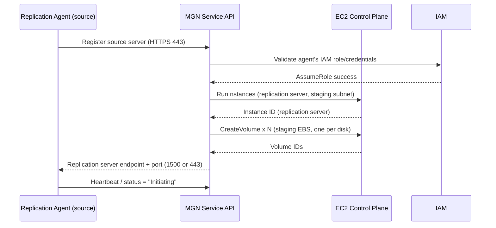

### 1.6 What to verify before moving on
- [ ] Source server appears in **MGN Console → Source servers** list
- [ ] Status column shows a state (not blank/error) — expect **"Initial sync in progress"** shortly after
- [ ] No error banner: "Unable to connect to replication server" or "Stalled"
- [ ] On the source server, check agent logs:
  - Linux: `/var/log/aws-replication-agent/agent.log.0`
  - Windows: `C:\Program Files (x86)\AWS Replication Agent\service_state\service\service.log`
- [ ] Confirm outbound connectivity on **TCP 1500** (default, private data channel via VPN/DX) or **TCP 443** (if using the internet/public endpoint option) from the source server to the replication server's IP — check with:
  ```bash
  telnet <replication-server-private-ip> 1500
  # or
  nc -zv <replication-server-private-ip> 1500
  ```

### 1.7 Common mistakes
- Forgetting to open the correct outbound port on customer firewalls (1500 for private connectivity, 443 if using public/internet endpoint mode)
- Using an IAM user for the agent that lacks `AWSApplicationMigrationAgentPolicy`
- Installing the agent while the source server's clock is skewed >5 minutes from real time (breaks TLS handshake / SigV4 signing)
- Multiple NICs on source server causing the agent to bind the wrong interface for replication traffic

### 1.8 Troubleshooting tips
| Symptom | Likely Cause | Fix |
|---|---|---|
| Server never appears in console | Credentials invalid or network blocked outbound 443 to MGN endpoint | Re-run installer with valid keys; check egress to `mgn.<region>.amazonaws.com` |
| "Stalled" status immediately | Replication server unreachable on data port | Check security group of staging subnet allows inbound 1500/443 from source's public/VPN IP |
| Agent installs but service won't start | Missing OS prerequisites (Python on old Linux, .NET on old Windows) | Check installer log; install prerequisite; re-run |

### 1.9 What happens if this step fails
No staging infrastructure is created, no replication starts, and the source server either never appears or appears with a permanent error state. There is **no data risk** to the source server — MGN agent installation and registration are read-only/passive from the source application's perspective. Simply fix the blocking issue (credentials/network) and re-run the installer; it is idempotent.

---

## 2. Initial Sync — Deep Dive

### 2.1 What is happening technically in AWS
Initial Sync is a **full block-level copy** of every used block on every disk being replicated, sent from the source server to the staging EBS volumes. Internally MGN:

1. Snapshots the source disk's block bitmap (which blocks are "in use" per the filesystem) so it doesn't waste bandwidth copying empty space
2. Splits the used blocks into chunks, compresses each chunk, encrypts it with TLS, and streams it to the replication server
3. The replication server writes incoming chunks directly onto the **staging EBS volume**, which is provisioned at creation to match the source disk size (rounded to GB)
4. Progress is tracked as a percentage in the console: **"Initial sync in progress: 42%"**

### 2.2 Why we do this step
Continuous (delta) replication is only meaningful once a full baseline copy exists on the AWS side. Initial Sync establishes that baseline; every subsequent write on the source is captured as a delta against it.

### 2.3 What is happening on the source server
- Agent performs sequential + randomized read passes across the disk to build the block stream
- CPU load: moderate increase (typically 10-20% single core) due to compression before send
- Disk read I/O: sustained read load proportional to disk size / configured bandwidth throttle
- **No writes happen on the source** — this is 100% read-only against the source disk. Applications continue running normally; there is no downtime.
- If bandwidth throttling was configured in the Replication Settings Template, initial sync speed is capped (e.g., "5 Mbps max") — this directly extends initial sync duration

### 2.4 What data is being transferred
Every used block of the OS + data disks selected for replication (compressed, encrypted). For a typical 100GB used disk with default compression (~40-60% ratio depending on data type), expect **40-60GB actually transferred over the wire**.

**Rule of thumb sizing table:**

| Used Disk Size | Compression Ratio (typical) | Data Over Wire | On a 100 Mbps link | On a 1 Gbps link |
|---|---|---|---|---|
| 50 GB | 50% | 25 GB | ~35 min | ~4 min |
| 200 GB | 45% | 110 GB | ~2.5 hrs | ~15 min |
| 1 TB | 40% | 600 GB | ~13 hrs | ~1.3 hrs |
| 5 TB (SQL data) | 30% (DB pages compress less) | 3.5 TB | ~78 hrs | ~8 hrs |

> These are planning estimates only — always validate against the customer's actual measured link utilization and MGN's built-in bandwidth graphs (Source servers → server detail → **Replication** tab → throughput chart).

### 2.5 Which AWS services communicate
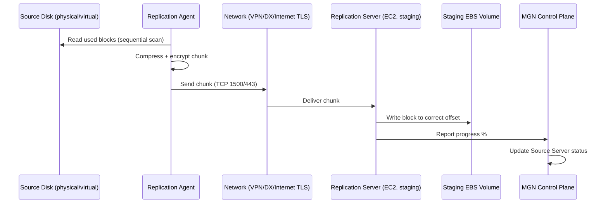

### 2.6 What to verify before moving to next step
- [ ] Status reaches **100%** and transitions automatically toward **"Healthy"** (see status table below)
- [ ] No sustained "Lag duration" growth (check the **Replication lag** metric — should trend toward 0 after initial sync completes)
- [ ] Data throughput graph shows expected utilization, not near-zero (near-zero = network problem, not just "slow")
- [ ] On source: `df -h` / Disk Management shows no unexpected disk-full errors caused by agent temp/cache files (agent uses minimal local disk, but always confirm free space > 5GB)

### 2.7 Common mistakes
- Assuming Initial Sync = full downtime window needed — **it is not**; the source stays live and serving traffic throughout
- Under-provisioning bandwidth throttle "to be safe" and then being surprised initial sync takes days on a 1TB SQL server
- Starting Initial Sync for 20 servers simultaneously without checking aggregate WAN bandwidth (classic Scenario 1 mistake — see Scenarios section)
- Not accounting for a VPN/DX bandwidth ceiling shared with other production traffic

### 2.8 Troubleshooting tips
| Symptom | Diagnosis | Action |
|---|---|---|
| Progress % stuck for >30 min | Network congestion or throttle set too low | Check Replication Settings Template throttle value; check WAN utilization |
| Progress resets to 0% | Agent service restarted / source rebooted mid-sync | Normal — sync resumes from where CBT bitmap allows; if it truly restarts from 0 repeatedly, check for agent crash in logs |
| "Disk not supported" error | Disk >  service limit, or using unsupported filesystem (e.g., ZFS raw, exotic RAID) | Check MGN disk/OS support matrix; may need to exclude and migrate that disk separately |
| High CPU on source impacting app | No throttle set, agent consuming too much | Add bandwidth/CPU throttle in Replication Settings, apply to source server, restart agent replication |

### 2.9 What happens if this step fails
If Initial Sync fails outright (connection drop, disk error), MGN marks the source server status as **"Stalled"** or **"Error"**. No partial/corrupt data is used downstream — MGN will not allow you to launch a test/cutover instance from an incomplete sync. You simply need to resolve connectivity/disk issues; MGN automatically resumes from the last successfully written block range (it does not necessarily restart 100% from zero, thanks to block-level tracking), minimizing wasted transfer.

---

## 3. Continuous Replication, Changed Block Tracking (CBT), Compression, Encryption

### 3.1 Changed Block Tracking (CBT) — how it actually works
After Initial Sync completes, the agent switches modes. Instead of scanning the whole disk, it hooks into the OS's I/O path (a filter driver on Windows, or `dm`/kernel module-level tracking on Linux) so that **every write operation is intercepted and the changed block's offset is recorded** in an in-memory + on-disk bitmap journal. Only blocks flagged "dirty" since the last replication cycle are read and sent — this is why continuous replication is dramatically lighter than initial sync.

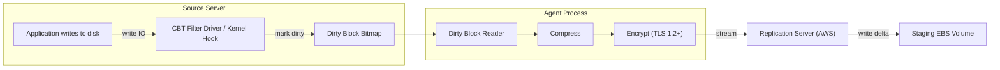

### 3.2 Replication frequency & "Lag"
MGN does **not** replicate on a fixed schedule like "every 15 minutes" — it is a **continuous, near-real-time stream**. The console reports a metric called **Lag Duration**: the time difference between "last write on source" and "last write successfully committed to staging EBS." Healthy systems typically show lag of **seconds to low single-digit minutes**. Lag grows when:
- Source write rate exceeds available replication bandwidth
- Network latency/packet loss increases
- Staging EBS volume throughput is under-provisioned (rare, but happens on very write-heavy DBs with `gp3` default IOPS)

### 3.3 Compression
Data is compressed **before** encryption (compressing after encryption is ineffective since encrypted data is high-entropy/incompressible). Typical ratios:
- OS/system files: 50-70% reduction
- Text/log-heavy data: 60-80% reduction
- Already-compressed data (media, some DB blob types): near 0% additional reduction
- SQL Server data pages: 20-40% (binary, semi-dense)

### 3.4 Encryption
Two layers:
1. **In-transit:** TLS-encrypted tunnel between agent and replication server (always on, cannot be disabled)
2. **At-rest:** Staging EBS volumes are encrypted using the KMS key specified in your Replication Settings Template (default AWS-managed `aws/ebs` key, or customer-managed CMK for stricter compliance — common requirement in public-sector/regulated customers)

### 3.5 Bandwidth usage controls
Set in **Replication Settings Template** (or per-server override under Source server → Replication settings):

| Setting | Purpose | Recommended Production Value |
|---|---|---|
| Data routing / Private IP | Send replication traffic over VPN/DX private IP instead of public internet | Enable if VPN/DX exists — reduces cost and improves security posture |
| Bandwidth throttling | Cap Mbps used by replication | Start at 20-30% of available WAN capacity during business hours; remove cap overnight if allowed |
| Right-sizing | Right-size staging volume type instead of matching source | Enable — saves cost by using `gp3` at baseline unless source shows high IOPS |
| Volume type for staging | gp3 default, io2 for very high-IOPS DBs | gp3 unless source disk shows sustained >3000 IOPS |

### 3.6 Verifying replication health
- [ ] Source server status = **Healthy** (not "Lagging" or "Stalled")
- [ ] Lag duration consistently under a few minutes
- [ ] Data change rate metric aligns with expected source write patterns (no unexplained spikes suggesting malware/unexpected process)
- [ ] No "Last seen" gap on the agent (agent should be reporting continuously)

### 3.7 Common mistakes
- Leaving default throttle unset on shared WAN links, saturating the link and impacting other business apps
- Ignoring persistent lag growth for days — this means your eventual cutover final-sync window will be long, not short
- Assuming CBT reduces CPU load to zero — it still requires read + compress + encrypt for every changed block, so heavy-write DB servers will show a permanent modest CPU/network tax

### 3.8 Troubleshooting
| Symptom | Cause | Fix |
|---|---|---|
| Lag keeps growing, never converges | Write rate > replication bandwidth | Increase throttle, use DX instead of internet, or replicate during lower-write-window |
| Intermittent "Stalled" then "Healthy" cycling | Unstable network / flapping VPN tunnel | Fix underlying network stability (this is a network team issue, not MGN) |
| CPU spikes on source correlating with replication | Compression overhead | Lower throttle so less data is queued for compression at once; consider CPU/IO scheduling priority for the agent process |

### 3.9 What happens if continuous replication fails/stops
The staging EBS volume simply stops receiving new deltas — it retains the last successfully replicated state. Test/cutover launches from that point would be **stale but not corrupted**. MGN will not silently let you cutover on badly lagging data without warning — the console explicitly shows lag/status, and best practice is to **never cutover while status ≠ Healthy**.

---

## 4. Full Status Lifecycle Reference

Every status you will see in the **Source servers** dashboard, what triggers it, what AWS is doing internally, how to verify, and what logs to check.

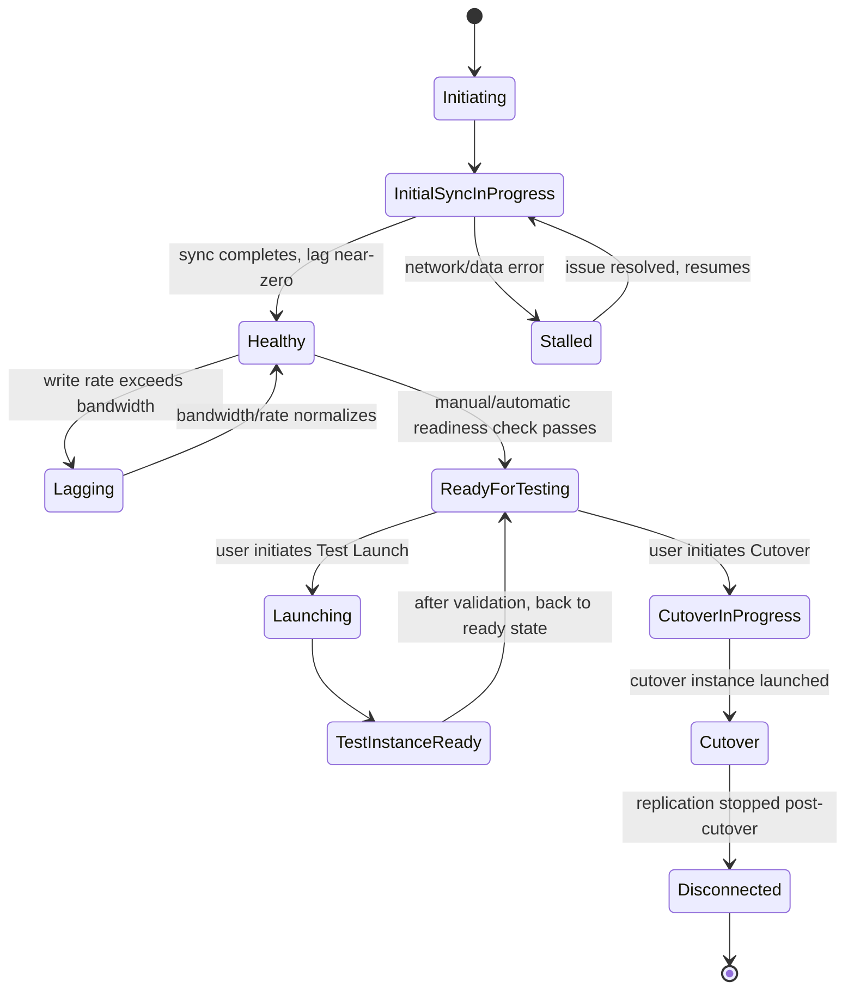

| Status | What triggered it | What AWS is doing internally | How to verify | Logs to inspect |
|---|---|---|---|---|
| **Initiating** | Agent just registered | Provisioning replication server + staging volumes | Console shows spinner/percentage=0 | Agent log; MGN console "Events" tab |
| **Initial sync in progress** | Baseline copy started | Streaming used blocks to staging EBS | % increasing steadily | Replication tab throughput graph |
| **Stalled** | Network drop, disk read error, throttle=0 | Waiting/retrying; no forward progress | % frozen for 15+ min | Agent log for connection errors; check SG/NACL |
| **Healthy** | Initial sync 100% + lag ~0 | Continuous CBT delta streaming | Lag duration < few min | Replication lag graph |
| **Lagging** | Write rate > available replication throughput | Queuing deltas, catching up | Lag duration climbing | Data change rate vs. throughput comparison |
| **Ready for testing** | Healthy status sustained + no active launch job | MGN confirms staging volumes are launch-consistent | Green checkmark next to server | N/A — this is a computed readiness state |
| **Launching** | User clicked Test/Cutover launch | MGN snapshotting staging EBS → creating new EBS from snapshot → EC2 RunInstances with Launch Template | Job progress in "Launch history" | CloudTrail: `RunInstances`, `CreateSnapshot`, `CreateVolume` |
| **Test instance ready / Cutover instance ready** | RunInstances succeeded, OS boot confirmed | EC2 instance running with converted boot volume, drivers injected (UEFI/BIOS conversion, driver injection for Nitro if needed) | Instance status checks 2/2 passed in EC2 console | EC2 System Log (Get System Log), MGN "Launch history" job detail |
| **Cutover** | Final sync completed + cutover instance launched | Replication marked complete for that server | Server tagged as cut over; replication can be stopped | MGN Source server detail page |
| **Disconnected** | Replication manually stopped or agent uninstalled post-cutover | Staging resources de-provisioned | Server no longer shows active replication metrics | N/A |

---

## 5. AWS Console Walkthrough — Screen by Screen

### 5.1 Source Servers Dashboard
**Location:** MGN Console → left nav **Source servers**

| Element | What to click | What matters | What to ignore | Recommended value | Why |
|---|---|---|---|---|---|
| Server name/hostname | Click row to open detail page | Confirm correct hostname maps to correct customer server (critical in 20-server migrations) | Internal MGN server ID unless scripting via CLI | N/A | Wrong-server mixups are the #1 real-world MGN mistake at scale |
| Status column | — | Must be **Healthy** before any launch action | Transient "Lagging" blips during business hours are normal | Wait for Healthy | Launching on non-Healthy data risks stale/incomplete cutover |
| Data replication progress bar | Hover for tooltip | % + lag duration | Exact byte counts (cosmetic) | — | — |
| "Test and Cutover" button (top right of server row) | Dropdown: Test / Cutover / Revert / Finalize | This is where all launch actions originate | — | — | — |

### 5.2 Source Server Detail Page → Tabs

**Replication tab**
- Throughput graph (Mbps sent) — verify it matches expected network utilization
- Lag duration graph — must trend to near-zero for Healthy
- Data change rate — useful for capacity planning of staging volumes

**Launch Settings tab** — covered in full depth in Section 6

**History tab**
- Every launch job (test/cutover) with timestamps, status, and a link to the underlying EC2 instance/CloudTrail event ID — **this is your audit trail for the customer**

### 5.3 Replication Settings Template (Settings → Replication Settings)
| Field | Recommended Production Value | Why |
|---|---|---|
| Staging area subnet | Dedicated subnet, no route to internet needed except MGN endpoints | Isolation + cost (no NAT GW charges for replication traffic if using VPC endpoints) |
| Staging area tags | e.g. `Project=Migration`, `CostCenter=...` | Cost allocation reporting — customers always ask "how much did staging cost" |
| Replication server instance type | Default (auto) unless very high server count → consider `t3.small`/`t3.medium` | Auto sizing is usually correct; override only under heavy load (20+ concurrent servers, Scenario 1) |
| EBS volume type for staging | gp3 | Cheaper than gp2/io2 at equal baseline performance for staging use case |
| EBS encryption | Enable, use customer CMK if compliance requires (common for public sector/FedRAMP/gov customers) | Data-at-rest compliance |
| Data routing (Private IP) | Enable if VPN/DX available | Security + avoids data transfer costs over public internet path |
| Point-in-time (PIT) snapshot policy | Enable with retention (e.g., hourly for 24h, daily for 7d) | Allows rollback to an earlier replication point if a bad write (e.g., ransomware, bad patch) hits the source — **often overlooked but critical for production migrations** |
| Bandwidth throttling | Set per network capacity plan | Avoid WAN saturation |

---

## 6. Launch Settings — Full Deep Dive

**Location:** Source server detail page → **Launch settings** tab (or bulk-edit via Source servers list → select multiple → "Edit launch settings")

This is the single most important configuration surface before any launch, because it defines **what the target EC2 instance will look like** — MGN does not guess; every field below directly maps to an `EC2 RunInstances` API parameter under the hood via a generated **EC2 Launch Template**.

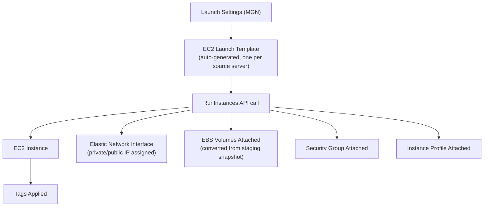

### 6.1 Field-by-field

| Setting | What it controls | Recommended Value | Why | What AWS creates automatically |
|---|---|---|---|---|
| **Instance type** | EC2 instance family/size for test & cutover instance | Match source vCPU/RAM 1:1 minimum, or use MGN's "Right-sizing" recommendation (based on observed CPU/RAM utilization during replication) | Under-sizing causes app performance issues post-cutover; over-sizing wastes cost | Nothing extra — just the instance type field in the launch template |
| **Subnet** | Which VPC/subnet the *test* or *cutover* instance lands in | **Two separate subnets**: a "test" subnet (isolated, no prod routing) and a "cutover"/production subnet | Prevents a test instance from accidentally colliding with production (duplicate hostnames/IPs, AD conflicts) | ENI created in chosen subnet |
| **Security group** | Firewall rules for the launched instance | Purpose-built SG per tier (web/app/db), least privilege, NOT "copy of source" blindly | Source servers on-prem often have overly permissive local firewall/no firewall — don't inherit bad habits | SG attached to ENI |
| **IAM instance profile** | Role attached to the EC2 instance itself (not the migration process) | Whatever the application needs going forward (e.g., S3 read access, SSM access) — **always attach `AmazonSSMManagedInstanceCore`** for post-migration manageability | Enables SSM Session Manager access without needing RDP/SSH/bastion — huge operational win | Instance profile attached at launch |
| **Key pair** | SSH/RDP key for initial access | Use a **dedicated migration key pair**, rotate/remove after cutover; better — rely on SSM Session Manager and skip key pair entirely where possible | Reduces long-lived credential sprawl | Public key injected via metadata service (Linux) or unused if SSM-only |
| **Tags** | Cost allocation, ownership, automation | `Name`, `Environment=Test/Prod`, `MigrationWave`, `Owner`, `CostCenter` | Customer FinOps and CMDB requirements; also lets you bulk-filter later for cleanup | Tags applied to instance + attached volumes + ENI |
| **Private IP** | Static vs. auto-assigned | For **cutover**, often must match the *exact* IP of the decommissioned on-prem server (DNS, firewall rules, app configs reference it) | Avoids breaking hardcoded IP dependencies (very common in legacy apps, AD, DB connection strings) | ENI gets specified private IP |
| **Public IP** | Whether instance gets a public IP/EIP | Almost always **disabled** for production; enabled only for controlled test scenarios needing direct internet validation | Security best practice — production instances should sit behind ALB/NAT, not have direct public IPs | EIP association if enabled |
| **Boot mode / EBS volume type for target** | Match source (BIOS vs UEFI), gp3 vs io2 for the *production* converted volumes | gp3 baseline unless DB needs io2 provisioned IOPS | Right balance of cost/performance for steady-state production, distinct from the staging volume decision made earlier | New EBS volumes created from staging snapshot at launch time |
| **Right-sizing** | MGN's auto-recommendation engine | Enable — review recommendation before accepting | Data-driven sizing based on actual observed source utilization, not guesswork | — |
| **Post-launch actions (SSM Automation documents)** | Optional automated scripts after launch (e.g., domain join, install CloudWatch agent, run validation script) | Configure for repeatable/scaled migrations (Scenario 1: 20 servers) | Removes manual per-server post-launch toil | SSM Automation execution triggered post-boot |

### 6.2 What AWS creates automatically behind the scenes at launch time

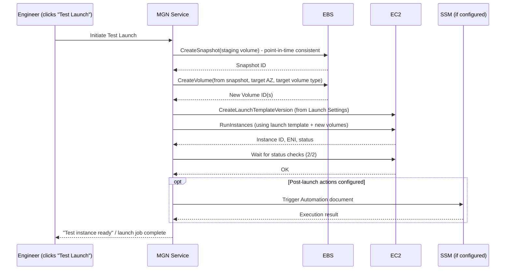

### 6.3 Verify before launching
- [ ] Correct subnet selected (test ≠ production subnet unless intentionally doing cutover)
- [ ] Security group reviewed, not just inherited default
- [ ] IAM instance profile includes SSM for manageability
- [ ] Private IP strategy decided (especially for AD/DNS-sensitive servers — see Scenario 3)
- [ ] Tags populated for cost tracking
- [ ] Right-sizing recommendation reviewed, not blindly accepted for DB servers (Scenario 2 needs manual override often)

### 6.4 Common mistakes
- Copying the source server's on-prem security posture (often "allow all" internally) directly into AWS SG — this is a real security regression customers won't notice until an audit
- Forgetting to change subnet from "test" to "production" before clicking **Cutover** (launching the actual cutover instance into the test/sandbox subnet by mistake)
- Not attaching SSM instance profile, then discovering no RDP/SSH access path when key pair is lost or NACLs block it
- Leaving Public IP enabled by default on a production cutover instance

### 6.5 Troubleshooting
| Symptom | Cause | Fix |
|---|---|---|
| Instance launches but never passes status checks | AMI/driver mismatch (missing Xen/Nitro drivers on old OS) | Check EC2 system log; may need OS driver injection support (MGN handles most automatically, but very old OS like Windows 2003/RHEL5 need manual driver prep pre-migration) |
| Instance boots but no network | Wrong subnet/SG, or missing route table entry | Verify subnet route table has IGW/NAT/VPN route as appropriate; verify SG inbound rules |
| Instance boots into wrong hostname/IP causing app failure | Static IP/hostname not correctly configured in Launch Settings | Re-check "Private IP" field and any post-launch hostname scripts |

### 6.6 What happens if launch fails
The **source server replication is unaffected** — a failed test/cutover launch does not touch or corrupt the staging data. MGN marks the launch job "Failed" in History tab with a reason. You fix the Launch Settings issue and simply re-launch (Test) — this is why **Test Launch is safe to repeat as many times as needed**, a key selling point for customer confidence.

---

## 7. Test Launch → Validation → Rollback → Cutover → Final Sync → Cleanup

### 7.1 Test Launch

**Console path:** Source servers → select server(s) → **Test and Cutover → Test**

**What's happening in AWS:** Exactly the sequence in the 6.2 diagram above — snapshot staging volume, create new EBS from it, launch EC2 in the **test subnet** using Launch Settings, marked with the flag "test instance" in MGN metadata so the system knows this launch does not represent a completed migration.

**Why we do this:** Validate that the application actually boots and functions correctly on AWS *before* committing to a real cutover — this is the single biggest risk-reduction step in the whole project and should never be skipped, even under schedule pressure.

**Replication continues uninterrupted** during test launch — this is a critical differentiator: the source server keeps replicating live changes to the staging area even while a test instance runs from an earlier snapshot point-in-time.

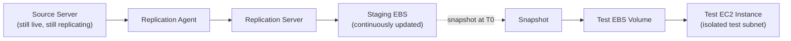

**CLI:**
```bash
aws mgn start-test \
  --source-server-id s-0123456789abcdef0 \
  --region us-east-1
```

**Verify:**
- [ ] EC2 instance status checks 2/2 passed (EC2 Console → Instances → filter by tag `AWSMGN-source-server` or via `aws ec2 describe-instances --filters "Name=tag:AWSMGN#SourceServerID,Values=s-0123..."`)
- [ ] RDP/SSH or SSM Session Manager connects successfully
- [ ] Application services start (check Windows Services / systemd unit status)
- [ ] Disk drive letters/mount points match expected layout
- [ ] Network connectivity to dependent systems (DB, AD, APIs) from the test instance

### 7.2 Validation

This is manual/scripted functional testing performed **by you and the application owner**, not an MGN feature per se, but MGN supports it via **Post-Launch Actions (SSM Automation)** that can run automated validation scripts immediately after boot.

**Recommended validation checklist (adapt per app):**
- [ ] OS boots, correct hostname
- [ ] All expected disks/volumes attached and mounted at correct paths
- [ ] Application/service auto-starts
- [ ] Application responds on expected port (`curl localhost:8080/health` or equivalent)
- [ ] Database connectivity (if app-tier server)
- [ ] Log files show no unexpected errors
- [ ] Domain join / AD authentication works (if applicable — Scenario 3)
- [ ] Performance baseline (CPU/RAM under light load) reasonable vs. source

**CLI to check post-launch action results:**
```bash
aws ssm list-command-invocations \
  --instance-id i-0abcd1234efgh5678 \
  --details
```

### 7.3 Rollback (from Test)

**What "rollback" means in MGN context:** Simply **terminate the test instance** — there is nothing to "roll back" on the source or on replication, because the test instance was a disposable copy. This is why testing in MGN carries essentially zero production risk.

**Console path:** Source servers → select server → **Test and Cutover → Mark as "Ready for cutover"** (this terminates the test instance automatically) — or manually terminate the EC2 test instance and the associated volumes will be cleaned up.

**CLI:**
```bash
aws mgn finalize-cutover \
  --source-server-id s-0123456789abcdef0
# (used after a successful CUTOVER, not test — for test cleanup, simply terminate the instance)

aws ec2 terminate-instances --instance-ids i-0abcd1234efgh5678
```

**Verify:** Confirm source server status returns to **Ready for testing / Healthy** (not stuck in "Launching") and replication is still active/Healthy.

### 7.4 Cutover

**Console path:** Source servers → select server → **Test and Cutover → Cutover**

**What happens technically:**
1. MGN requests a **final delta sync** — waits for lag duration to hit zero (all remaining in-flight changes from source committed to staging)
2. Snapshots the now fully-current staging volume
3. Launches the **cutover EC2 instance** using Launch Settings — this time typically into the **production subnet**, often with the **production static private IP**
4. This instance becomes your new production server

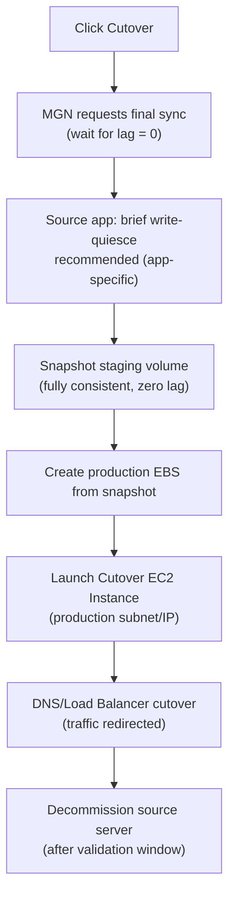

**Why a "write-quiesce" matters:** MGN's final sync captures whatever is on disk at that moment. For transactionally sensitive apps (SQL Server, AD), best practice is a brief **application-level pause** (stop app service, or put DB in a consistent state) immediately before cutover so the final snapshot represents a clean, consistent state rather than a mid-transaction disk image. For most stateless app-tier servers this is unnecessary; for databases it is **strongly recommended** (see Scenario 2).

**CLI:**
```bash
aws mgn start-cutover \
  --source-server-id s-0123456789abcdef0 \
  --region us-east-1
```

**Verify:**
- [ ] Lag duration = 0 immediately before triggering cutover
- [ ] Cutover instance passes status checks
- [ ] DNS records / load balancer target groups updated to point to new instance
- [ ] Application fully functional from the actual production entry point (not just direct IP test)
- [ ] Monitoring/alerting (CloudWatch agent, existing APM) reporting correctly

### 7.5 Final Sync — what it actually is
"Final Sync" is not a separate button — it is the automatic last delta replication cycle MGN performs as part of the Cutover workflow, ensuring zero data loss between "last replicated block" and "moment of cutover launch." The **only manual action you take** to minimize its duration is quiescing writes on the source (Section 7.4) — the smaller the pending delta, the faster this final sync completes, meaning the smaller your effective "cutover window" is.

### 7.6 Stopping Replication

**Console path:** Source servers → select server → **Actions → Disconnect from AWS Application Migration Service** (or "Mark as archived")

**Why:** Once cutover is validated and stable (recommend **minimum 24-48 hours** of stability observation for production servers, longer for critical DB/AD servers), you stop paying for and running the staging replication server + staging EBS volumes for that source server.

**CLI:**
```bash
aws mgn disconnect-from-service \
  --source-server-id s-0123456789abcdef0
```

**What AWS tears down:** The replication server EC2 instance (staging) and the staging EBS volumes for that specific source server are deleted. The agent on the (now decommissioned) source server stops sending data — if the physical/VM source server itself is being decommissioned, you'd also uninstall/power off the source machine per customer's decommission process.

### 7.7 Cleaning Up Resources

Full cleanup checklist:

| Resource | Action | Command / Console Path |
|---|---|---|
| Staging replication servers | Auto-removed on Disconnect | Verify none remain: `aws ec2 describe-instances --filters "Name=tag:aws:mgn:source-server-id,Values=s-..."` |
| Staging EBS volumes | Auto-removed on Disconnect | `aws ec2 describe-volumes --filters "Name=tag:aws:mgn:source-server-id,Values=s-..."` |
| Leftover test instances | Manually terminate if any forgotten | EC2 Console, filter by tag |
| Test-only EBS volumes/snapshots | Delete manually if not auto-cleaned | `aws ec2 describe-snapshots --owner-ids self` and filter by MGN tags |
| Source server entry in MGN console | Mark **Archived** once fully done | Console → Actions → Mark as archived |
| Temporary IAM credentials used by agent installer | Rotate/revoke if static keys were used | IAM Console |
| Firewall rules opened for replication (source-side) | Close port 1500/443 rule if no longer needed | Customer firewall team |
| Decommission source server (physical/VM) | Per customer's ITSM/CMDB decommission process | Customer process, outside AWS |

**Verify final state:**
- [ ] No orphaned EC2 instances/volumes tagged with MGN source-server IDs remain
- [ ] Cost Explorer no longer shows staging-related EC2/EBS line items after 24-48h
- [ ] Source server record shows **Archived** or is removed from active dashboard
- [ ] Runbook/CMDB updated with new production instance ID, IP, and decommission date of old server

---

## 8. Realistic Production Scenarios

### Scenario 1 — 20 Windows Servers (Wave Migration)

**Key behavior:** MGN scales horizontally — each source server gets its own agent, its own replication server, its own staging volumes. There is no shared bottleneck **inside AWS**, but there absolutely is one on the **customer's WAN link**.

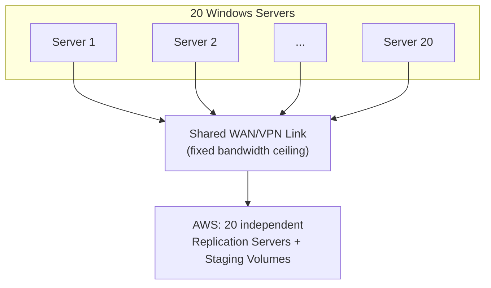

**Practical execution plan:**
1. Group into **waves** of 4-6 servers based on WAN capacity, not all 20 at once
2. Set aggregate bandwidth throttle per server = (available WAN capacity ÷ concurrent servers in wave)
3. Use **Launch Settings bulk edit** to apply consistent SG/subnet/tag policy across the batch rather than configuring 20 times manually
4. Use **Post-Launch Actions (SSM Automation)** to standardize post-boot steps (CloudWatch agent install, domain join, hostname verification) — critical at this scale to avoid manual toil/errors
5. Stagger Test Launches across waves, not all 20 simultaneously (avoids simultaneous EBS/EC2 API throttling and makes validation manageable)
6. Track progress with a simple wave table (Wave 1: servers A-F, target cutover date X; Wave 2: ...)

**Common mistake at this scale:** Starting all 20 initial syncs simultaneously, saturating the VPN tunnel, causing every server to show "Stalled/Lagging" and creating false alarm. Always throttle and wave.

### Scenario 2 — SQL Server

**Key behavior:** Block-level replication doesn't understand SQL transactions — it just sees disk blocks. This is fine for continuous replication (SQL's own write-ahead logging keeps disk-level consistency reasonable), but **cutover requires special care** to guarantee a clean database state.

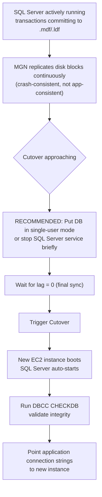

**Practical steps specific to SQL:**
- Before final cutover, briefly stop the SQL Server service (or use `ALTER DATABASE ... SET SINGLE_USER` for a shorter, less disruptive quiesce) — this guarantees the on-disk state MGN captures is fully flushed, not mid-write
- After cutover instance boots, run `DBCC CHECKDB` before declaring success
- Validate SQL Server Agent jobs, linked servers, and login (SIDs) are intact — these are common breakage points in P2V/lift-and-shift because SQL logins are tied to SIDs which usually transfer fine with MGN (full OS-level replication), but always verify
- If using SQL Always On / clustering, MGN migrates each node as an independent source server — cluster reconfiguration afterward is a manual/scripted step outside MGN's scope

**Common mistake:** Cutting over a SQL server without stopping the service first, resulting in a technically "crash consistent" but riskier final state — usually fine (SQL is designed to recover from crash-consistent images), but not best practice for production financial/critical databases.

### Scenario 3 — Active Directory

**Key behavior:** AD is the highest-risk MGN scenario because of **SID conflicts, FSMO roles, and replication topology** — MGN does not understand AD replication, only disk blocks.

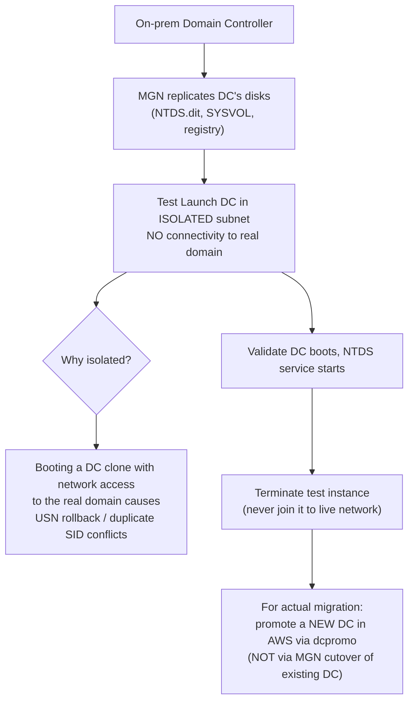

**Critical guidance:** For Domain Controllers, the recommended practice is generally **NOT** to MGN-cutover an existing DC directly into production network connectivity. Instead:
- Use MGN to validate that the DC's disks/OS are healthy and could theoretically boot (useful for DR scenarios)
- For the actual AWS migration, **stand up a brand-new DC in AWS** using normal `dcpromo`/AD replication from an existing healthy DC, let it replicate via native AD replication (not MGN), then decommission the old on-prem DC through standard AD procedures (`ntdsutil` metadata cleanup, FSMO role transfer)
- If MGN is used for DR/pilot-light purposes only (not a live cutover), always launch/test in a **fully network-isolated subnet** to avoid USN rollback corrupting the live domain

**Common mistake:** Treating a DC exactly like any other Windows server and doing a live MGN cutover directly onto the network — this can cause serious AD replication corruption (USN rollback) affecting the entire domain, not just the migrated server.

### Scenario 4 — Web Application Connected to a Database

**Key behavior:** Multi-tier dependency — sequencing and connection-string/DNS updates matter more than the MGN mechanics themselves.

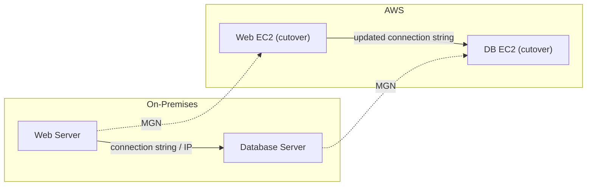

**Practical sequencing:**
1. Migrate/cutover the **database tier first**, validate independently (connect with a DB client tool directly)
2. Migrate/cutover the **web tier second**, updating its connection string/DNS entry to point at the new DB instance's new IP or (better) a stable DNS name / RDS-style endpoint if you're also modernizing
3. Test the full path end-to-end (browser → web tier → DB tier) before declaring the migration complete
4. Keep both source servers in a **rollback-ready state** (replication not yet disconnected) until the full two-tier validation passes — don't disconnect DB replication just because DB testing alone passed

**Common mistake:** Cutting over both tiers simultaneously without sequencing, making it hard to isolate which tier caused a post-cutover failure. Always cut over dependency-first (DB before Web, AD before app servers that depend on domain auth, etc).

---
## 11. Final Production-Readiness Checklist (Print This)

- [ ] All source servers show **Healthy** status with lag < 2 min, for at least 24h continuous
- [ ] Launch Settings reviewed per-server (subnet, SG, IAM profile w/ SSM, IP strategy, tags)
- [ ] Test Launch completed and functionally validated for every server
- [ ] Sequencing plan confirmed for multi-tier scenarios (DB before Web, AD before domain-joined servers)
- [ ] Maintenance window / cutover window communicated to customer stakeholders
- [ ] Rollback plan documented (source server kept powered on/replicating until stabilization period ends)
- [ ] DNS/Load Balancer change plan documented with exact records to update
- [ ] Post-cutover validation checklist ready to execute immediately after cutover
- [ ] Cleanup/disconnect scheduled only after minimum stabilization period (24-48h+, longer for DB/AD)
- [ ] CMDB/documentation update plan ready for immediately after go-live

---
